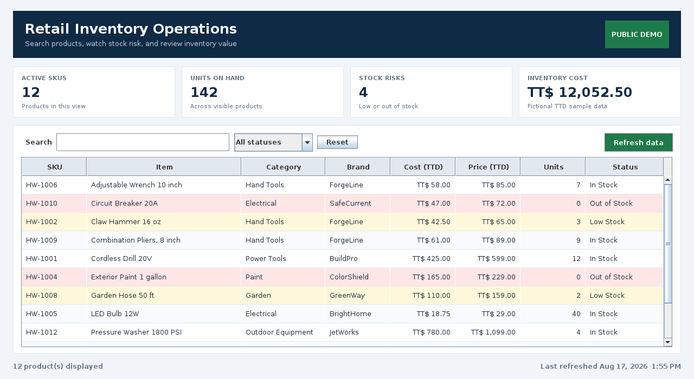

# Hardware Inventory System

[](https://github.com/ramphalharrilal/hardware-inventory-system/actions/workflows/ci.yml)
[](https://openjdk.org/projects/jdk/17/)
[](LICENSE)

A Java desktop operations dashboard designed around a real hardware-retail workflow: help staff find products quickly, surface stock risks, and understand the value of inventory on hand.

This is a public portfolio edition. It uses synthetic products and prices and contains no client data, spreadsheet links, or credentials.

## Product Preview

The dashboard combines search, status filtering, sortable product data, and operational metrics in one staff-friendly view.



## What It Solves

| Operational need | Application response |
| --- | --- |
| Staff spend too long scanning spreadsheet rows | Instant search across SKU, product, category, and brand |
| Low stock is easy to miss | Status rules, filters, and visible risk highlighting |
| Managers need a quick snapshot | Live SKU, unit, stock-risk, and inventory-cost metrics |
| Data storage may change | Repository contract separates data access from business logic and UI |

## Engineering Highlights

- Java 17 and Swing with a layered package structure
- Maven build with an executable JAR manifest
- Immutable domain records and `BigDecimal` money calculations
- CSV parser with quoted-field handling and explicit validation errors
- Service-layer search, filtering, sorting, and inventory summaries
- JUnit 5 coverage for domain rules, parsing, and business logic
- GitHub Actions verification on pull requests and `main`
- Privacy-safe sample data and credential exclusions

## Architecture

```text
UI (Swing)  ->  InventoryService  ->  InventoryRepository  ->  CSV demo data
                                            |
                                            +-> private data adapter (not published)
```

See the [case study](docs/case-study.md) for the business context, technical decisions, privacy boundary, and next iteration.

## Run Locally

Requirements: Java 17+ and Maven 3.9+.

```bash
git clone https://github.com/ramphalharrilal/hardware-inventory-system.git
cd hardware-inventory-system
mvn clean verify
mvn exec:java
```

To build and run the executable JAR:

```bash
mvn clean package
java -jar target/hardware-inventory-system-1.0.0.jar
```

To load another CSV with the same eight-column format:

```bash
java -jar target/hardware-inventory-system-1.0.0.jar /path/to/inventory.csv
```

## Data Contract

```csv
sku,name,category,brand,cost_price,selling_price,quantity,reorder_level
```

The committed file at `src/main/resources/data/sample-inventory.csv` is fictional and safe to use for demonstrations.

## Test

```bash
mvn test
```

Tests cover:

- in-stock, low-stock, and out-of-stock rules;
- case-insensitive search across business fields;
- CSV parsing, including quoted commas;
- invalid-row handling;
- filtering and operational summary calculations.

## Public and Client Editions

The public edition uses CSV data and neutral branding. A private client-oriented edition can connect to Google Sheets through the same repository contract, with credentials stored only on an authorized machine. That adapter, all real inventory records, and business-specific configuration remain outside this repository.

## Roadmap

- Role-based access
- Stock movement and audit history
- Barcode input
- Reorder recommendations
- Purchasing and sales exports

## Author

Built by [Ramphal Harrilal](https://ramphalharrilal.github.io/), an IT support and software professional focused on practical tools that improve everyday operations.
