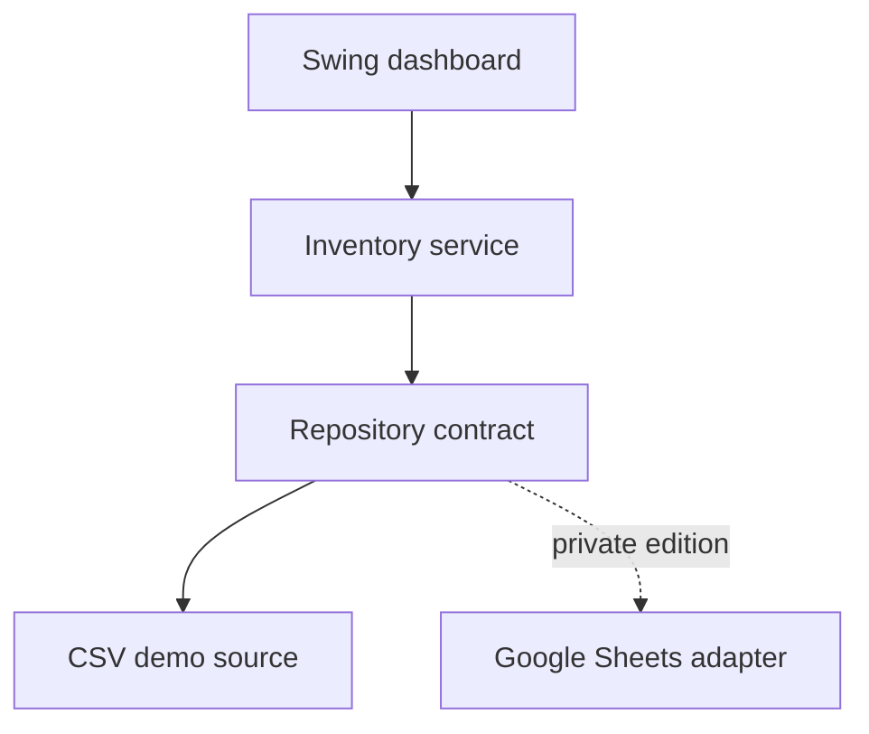

# Case Study: From Spreadsheet Lookup to Inventory Operations Dashboard

## Context

A small hardware retailer needed a faster way for staff to find products, check stock, and identify items that required attention. The existing workflow depended on manually scanning spreadsheet rows, which becomes slower and more error prone as the product list grows.

This public repository is a privacy-safe edition of that business problem. All products, SKUs, brands, quantities, and prices in the repository are fictional.

## Users and Jobs to Be Done

| User | Job |
| --- | --- |
| Counter staff | Find a product quickly while helping a customer |
| Inventory staff | Spot low-stock and out-of-stock items before they affect sales |
| Manager | Understand the value and condition of visible inventory |
| Developer or administrator | Replace the data source without rewriting the interface |

## Solution

The application provides:

- search across SKU, product, category, and brand;
- stock-status filtering and visual risk highlighting;
- live metrics for SKUs, units, stock risks, and inventory cost;
- a CSV-backed public demo data source;
- a repository interface that keeps storage concerns separate from business and UI logic.

## Architecture

The public repository contains only the CSV implementation. The original client-oriented edition can use a Google Sheets adapter without placing credentials or business data in source control.

## Engineering Decisions

| Decision | Reason |
| --- | --- |
| `BigDecimal` for money | Avoid floating-point rounding errors in prices and totals |
| Repository interface | Make the data source replaceable and testable |
| Service layer | Keep filtering and summary logic independent of Swing |
| Immutable domain records | Reduce accidental state changes |
| Synthetic public data | Demonstrate the workflow without exposing a business |
| Maven and CI | Make builds repeatable and automatically verified |

## Privacy and Security Boundary

The repository intentionally excludes:

- business inventory records and live prices;
- spreadsheet IDs and links;
- API credentials and service-account keys;
- customer or transaction data;
- client branding that is not approved for redistribution.

`.gitignore` also blocks common local credential filenames from accidental commits.

## Validation

Automated tests cover stock classification, search behavior, CSV parsing, invalid data, and summary calculations. GitHub Actions runs the full Maven verification workflow on every pull request and every change to `main`.

## Next Iteration

The next production-focused increment would add authenticated roles, stock-movement history, barcode input, reorder recommendations, and an auditable export for purchasing decisions.
